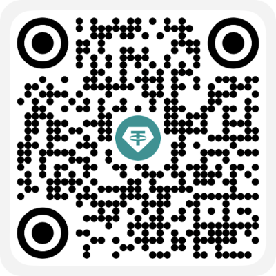

# Vue 3.6 源码解析案例

## 介绍

本项目为掘金专栏《[Vue 3.6 源码解析](https://juejin.cn/column/7587769767852720174)》系列文章的代码案例。

案例源码存放于 `./vue` 目录。

> 💡 不同文章会对应不同的案例（Git Tag 或分支不同），每篇文章开头均会标明其对应的案例地址，请留意区分。

## 请我喝杯咖啡

TRC20 链上地址：`TFcsSVCSFCV5QuPCwK5UtsajuXtWLEbi29`

> `广告` 尝试了解和交易比特币？来全球最大的交易平台「[币安](https://accounts.bmwweb.academy/register?ref=275849045)」试试。
>
> `广告` 需要一个长期稳定又好用的 VPN？试试「[少数人](https://2.a.xn--gmqz83awjh.site/auth/register?code=SbU4)」。